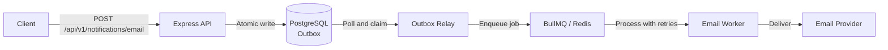

# BullMQ Email Notification System

A backend email notification system built with **Node.js, TypeScript, PostgreSQL, Redis, and BullMQ**, demonstrating asynchronous job processing, the Transactional Outbox pattern, idempotency, and at-least-once delivery with failure recovery.

---

## Architecture



PostgreSQL holds durable notification state. Redis and BullMQ manage the async job queue. The Transactional Outbox bridges them without a distributed transaction.

---

## Features

- **Idempotent API** — repeat requests with the same `Idempotency-Key` are deduplicated safely
- **Transactional Outbox** — notification and outbox event written atomically; no silent drops
- **Asynchronous processing** — BullMQ workers process jobs independently with concurrency control
- **Retry and backoff** — automatic exponential backoff on transient failures
- **Dead-letter queue** — exhausted jobs are captured and can be replayed
- **Provider abstraction** — swap between Resend and a simulated provider at runtime
- **Health and readiness endpoints** — liveness and database connectivity checks
- **Multi-stage Docker image** — non-root user, production dependencies only, migrations bundled
- **CI/CD** — GitHub Actions builds, tests, and publishes to GHCR on every push to `main`

---

## Tech Stack

| Layer | Technology |
|---|---|
| Runtime | Node.js 22, TypeScript |
| API | Express 5 |
| Queue | BullMQ 6, ioredis 6 |
| Database | PostgreSQL 16 |
| Email | Resend, Simulated provider |
| Testing | Vitest, Supertest |
| Infrastructure | Docker, Docker Compose, GitHub Actions |

---

## Getting Started

**Prerequisites**: Docker and Docker Compose.

```bash
git clone https://github.com/kaif-23/bullmq-notification-system.git
cd bullmq-notification-system

# Create your local environment file and configure credentials
cp .env.example .env

# Build the image and start infrastructure
docker compose build
docker compose up -d postgres redis

# Run database migrations
docker compose --profile migration run --rm migrations

# Start all application services
docker compose up -d api worker relay events
```

The API is available at `http://localhost:3000`.

See [`.env.example`](.env.example) for all supported environment variables. Do not commit `.env`.

---

## API

#### `POST /api/v1/notifications/email`

```bash
curl -X POST http://localhost:3000/api/v1/notifications/email \
  -H "Content-Type: application/json" \
  -H "Idempotency-Key: my-unique-key-1" \
  -d '{"email":"user@example.com","type":"welcome","data":{"name":"Kaif"}}'
```

Returns `201` with `{ "notificationId": 1, "status": "pending" }`.
Repeat requests with the same key and body return `200` with the existing notification.

#### `GET /api/v1/notifications/:notificationId`

```bash
curl http://localhost:3000/api/v1/notifications/1
```

Returns the current status (`pending`, `processing`, `sent`, or `failed`) and attempt count.

---

## Testing

Integration tests require PostgreSQL and Redis. Copy `.env.test.example` to `.env.test` and configure `TEST_DB_*` and `TEST_REDIS_*` before running locally.

```bash
npm install
npm run build   # TypeScript compilation
npm test        # Full test suite
```

---

## Docker Image

The application image is published to GitHub Container Registry:

```
ghcr.io/kaif-23/bullmq-notification-system:latest
```

```bash
docker pull ghcr.io/kaif-23/bullmq-notification-system:latest
```

The image runs as the non-root `node` user. PostgreSQL and Redis must be provided separately — see the Docker Compose setup above.
